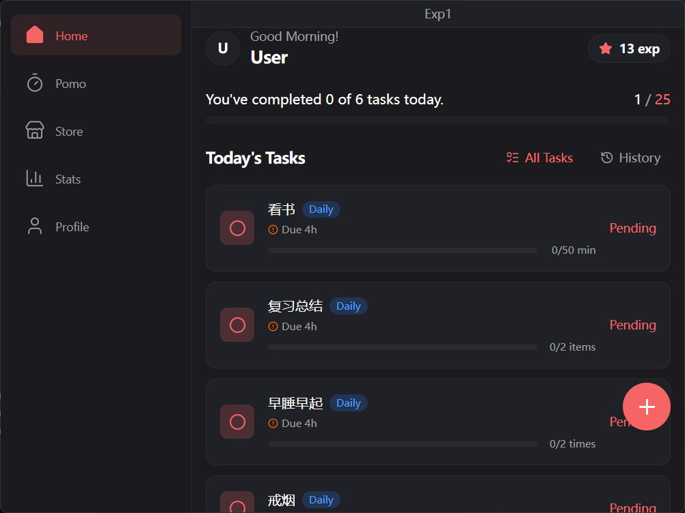
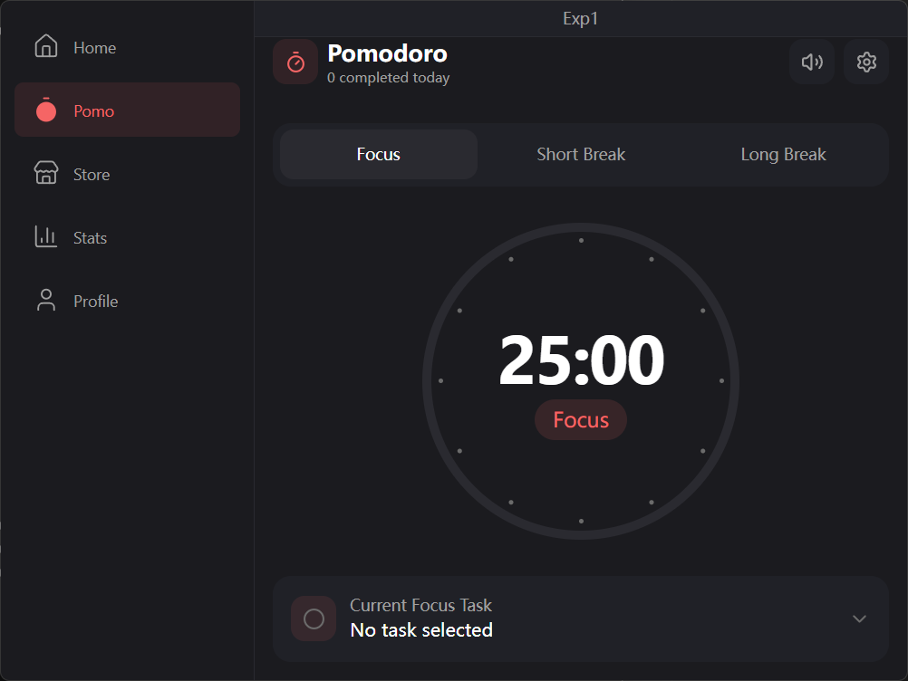
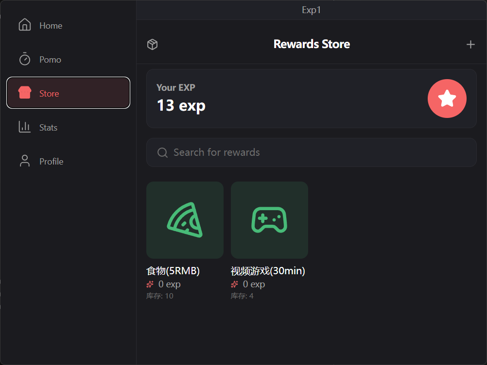
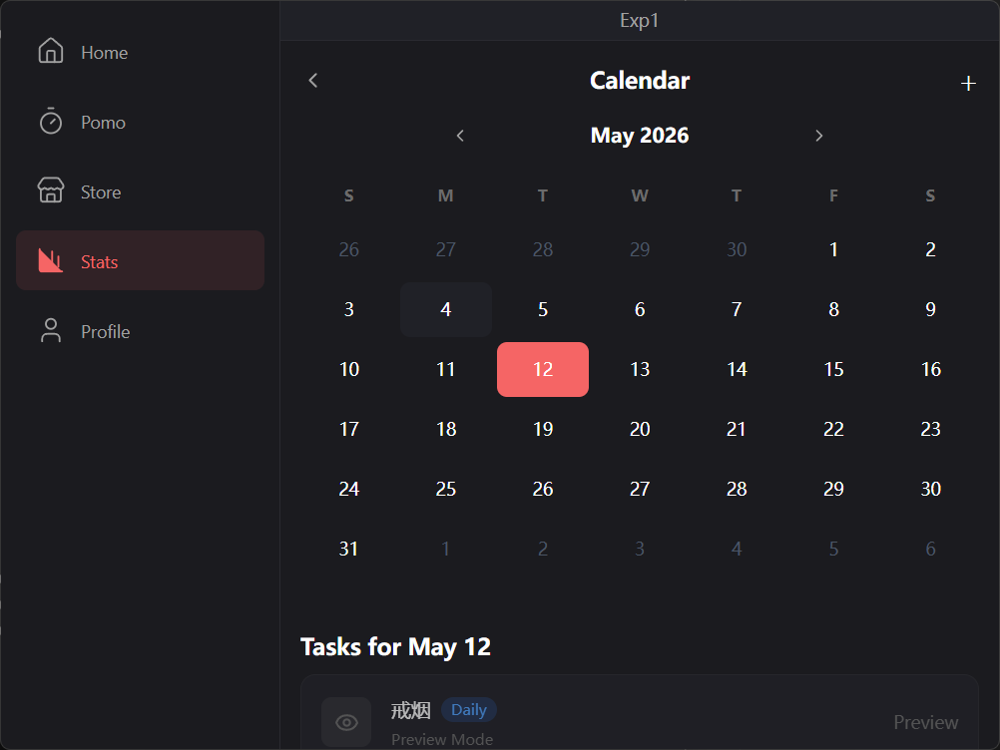
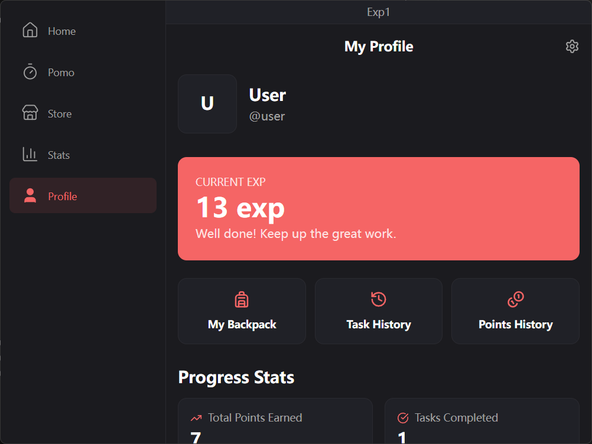
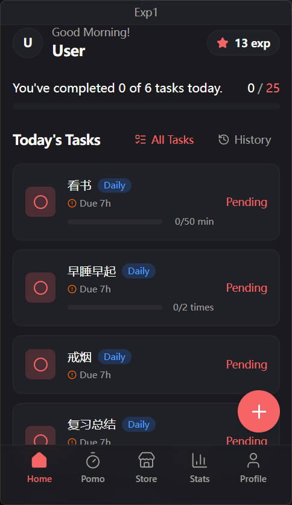
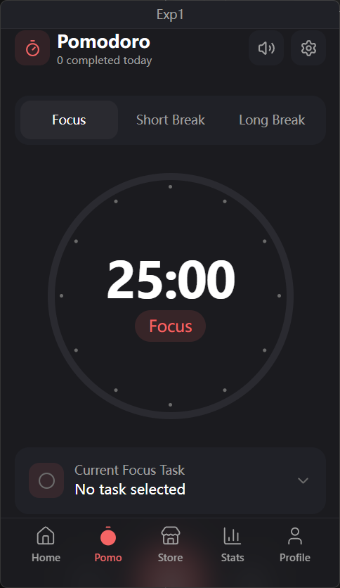
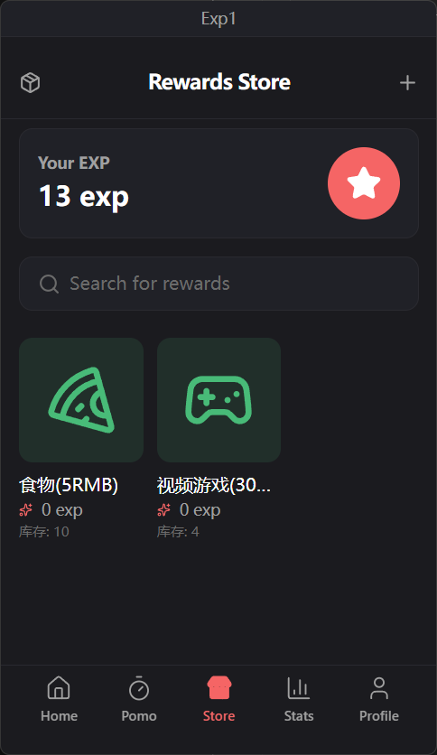
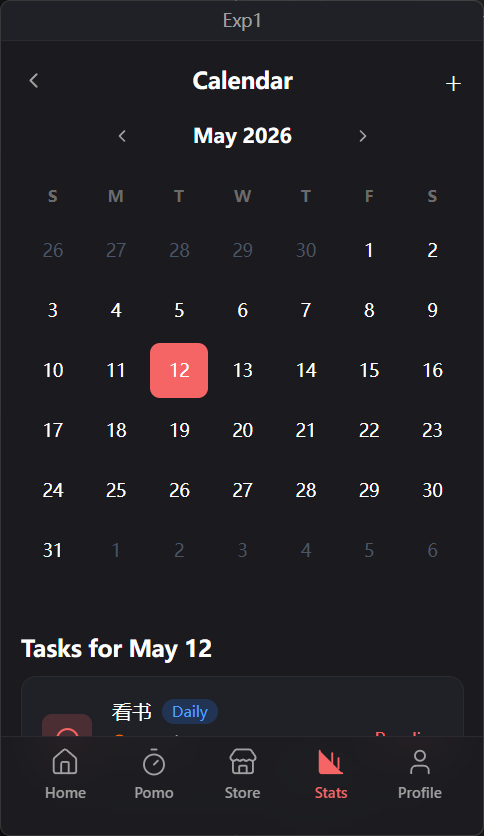
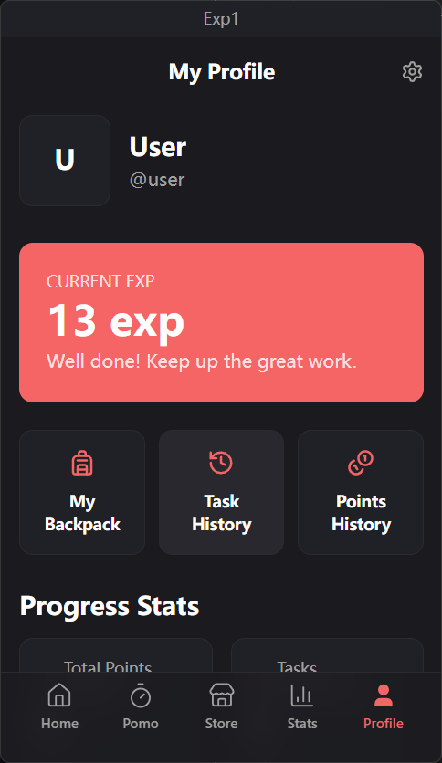

# exp1 - 任务+积分工具

一个用于激励用户培养习惯的游戏化任务管理应用。

## 功能特性

- 📝 **任务管理** - 多任务类型（简单/时间/计数/子任务），支持按日/周/月循环，阶段积分奖励系统
- 🍅 **番茄钟** - 专注/短休/长休三种模式，可关联任务，追踪专注时长和中断次数
- 📅 **日历视图** - 直观查看任务完成情况
- 🎁 **奖励系统** - 使用积分兑换自定义奖励
- 🎒 **背包系统** - 管理已兑换的奖励物品
- 📊 **数据统计** - 任务进度、番茄钟会话、积分历史的全面统计
- 📡 **本地同步** - PC 与手机通过 QR Code 局域网同步数据
- 🔔 **通知提醒** - 番茄钟计时结束时发送系统通知
- 💾 **数据备份** - 支持 JSON 格式导入/导出数据

## Preview

### PC

|Home|Pomo|Store|Stats|Profile|
|-|-|-|-|-|
||||||

### mobile

|Home|Pomo|Store|Stats|Profile|
|-|-|-|-|-|
||||||

## 技术栈

- **框架**: Tauri v2 + React 19 + Vite
- **路由**: react-router
- **数据库**: dexie.js (IndexedDB)
- **状态管理**: Zustand
- **样式**: Tailwind CSS v4
- **语言**: TypeScript
- **图标**: lucide-react
- **包管理器**: bun

### 视觉风格

- **整体风格**：极简主义，深色主题
- **主色调**：红色 `#f56565`（强调）、浅红 `#fc8181`（hover）、暗红 `#e53e3e`
- **背景色**：深灰 `#1b1b1f`（主背景）、浅灰 `#202127`（卡片背景）
- **文字色**：白色 `#ffffff`（主要）、灰色 `#a0a0a0`（次要）、暗灰 `#6b6b6b`（辅助）
- **边框色**：`#2a2a30`
- **字体**：系统默认字体栈
- **图标**：Lucide 线性图标，1.5px 细线条
- **圆角**：小元素 6px，大元素 12px

## Android 调试包与发布包

Android 构建分为两个互不覆盖的包，可以在同一台设备上共存：

| 变体 | 包名 | 应用名 | 构建命令 |
|-|-|-|-|
| debug | `com.ruinb0w.exp1.debug` | exp1 Debug | `bun run dev:android` / `bun run build:android:debug` |
| release | `com.ruinb0w.exp1` | exp1 | `bun run build:android` / `bun run build:android:all` |

- debug 的独立包名来自 `src-tauri/gen/android/app/build.gradle.kts` 中的 `applicationIdSuffix = ".debug"`（`versionNameSuffix = "-debug"`），应用名来自 `app/src/debug/res/values/strings.xml`。
- 两个包的数据相互独立（各自的 IndexedDB、通知权限、后台服务与同步配置），debug 包首次安装是空数据库，需要迁移数据时使用应用内「设置 → 数据导入导出」。
- **`bun run dev:android` 不会自动拉起调试包**：tauri-cli 固定用 `tauri.conf.json` 的 `identifier`（`com.ruinb0w.exp1`）执行 `am start -n <identifier>/.MainActivity`，即指向 release 包。安装完成后请手动点桌面上的「exp1 Debug」图标，或执行 `bun run launch:android:debug`；dev 会话、Rust 热重载与前端 dev server 均不受影响。
- **dev server 地址由 CLI 自动探测**：`dev:android` 不再写死 `--host`，CLI 会打印 `Using <ip> to access the development server.` 并把 `devUrl` 的主机改成该 IP。手机需与电脑同一局域网，且先手动跑 `bun run dev`（vite 的 `--host` 已监听 0.0.0.0）。需要指定时用 `bun run dev:android -- --host <ip>`；若局域网不可用，可用 `adb reverse tcp:1420 tcp:1420` 配合 `bun run dev:android -- --host 127.0.0.1`。
- release 包签名仍使用 `~/.android/debug.keystore`（见 `app/build.gradle.kts` 的 `signingConfigs`），安装 `com.ruinb0w.exp1` 的 release APK 依旧可以原地升级。
- 重新执行 `tauri android init`（例如新增插件）可能重写 `app/build.gradle.kts`，之后请检查 `applicationIdSuffix` / `versionNameSuffix` 两行与 `app/src/debug/res/values/strings.xml` 是否仍然存在。

## Licence

本项目采用双重许可模式：

### 开源许可

本项目源代码在 [GNU Affero General Public License v3.0 (AGPL-3.0)](LICENSE) 下发布。

**核心要求：**

- ✅ 允许个人学习、研究使用
- ✅ 允许修改，但**修改后的项目必须开源**（相同许可证）
- ✅ 允许分发，但必须提供源代码
- ❌ **禁止闭源商用**（需获得商业许可）

### 商业许可

如需闭源使用或商业用途，请联系获得商业许可：

📧 **邮箱**: <ruinb0wman@gmail.com>

商业许可提供：

- 闭源使用权利
- 技术支持服务
- 专利授权保护
- 定制开发选项

---

## ⚠️ 重要声明

未获得书面商业许可前，任何商业使用、闭源集成均视为侵权。
