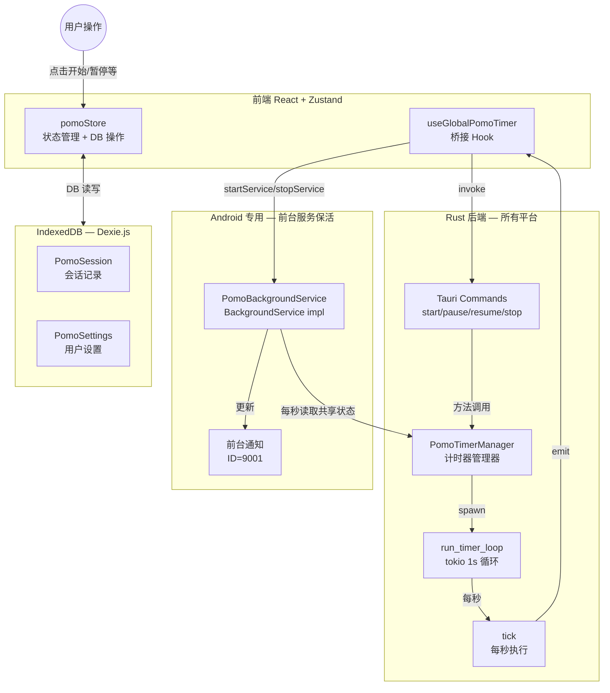
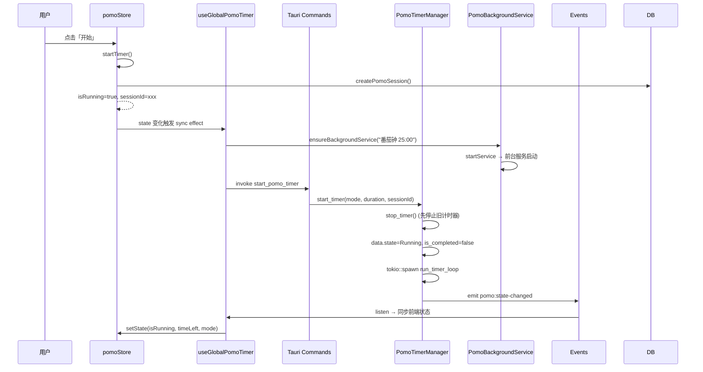
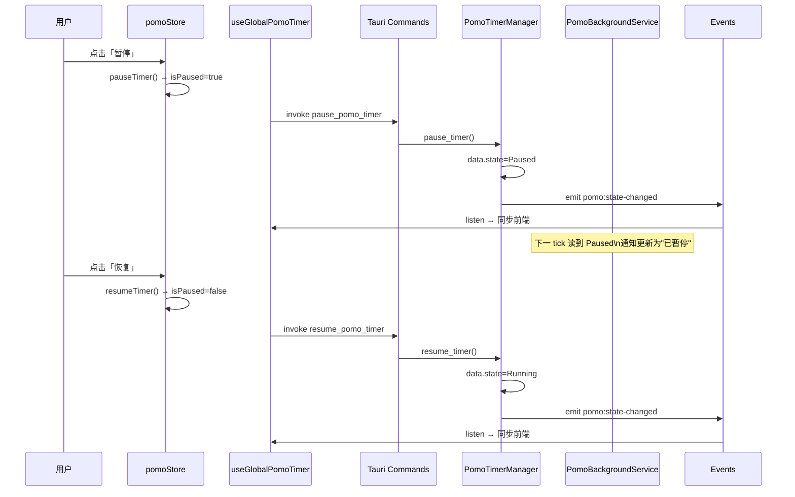
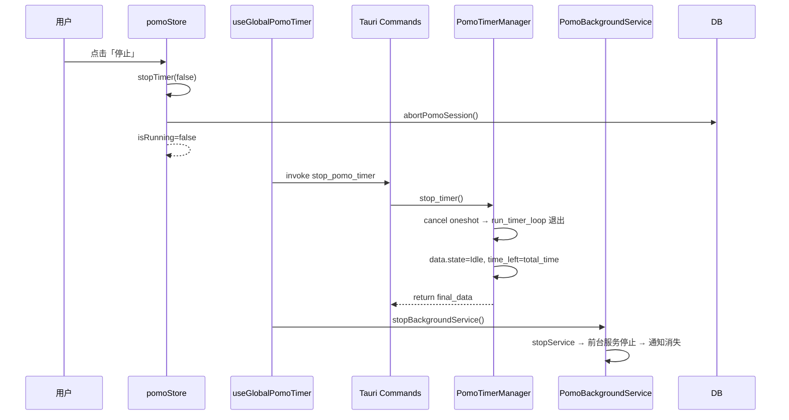
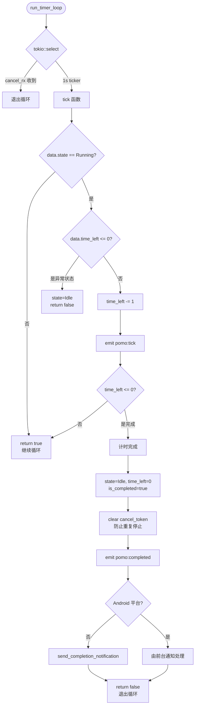
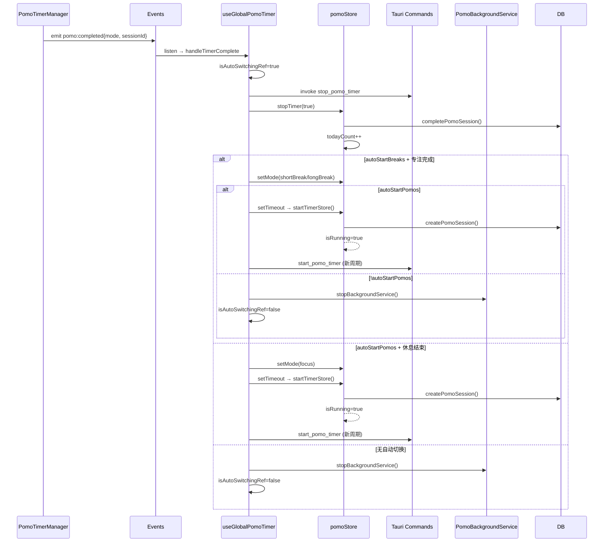
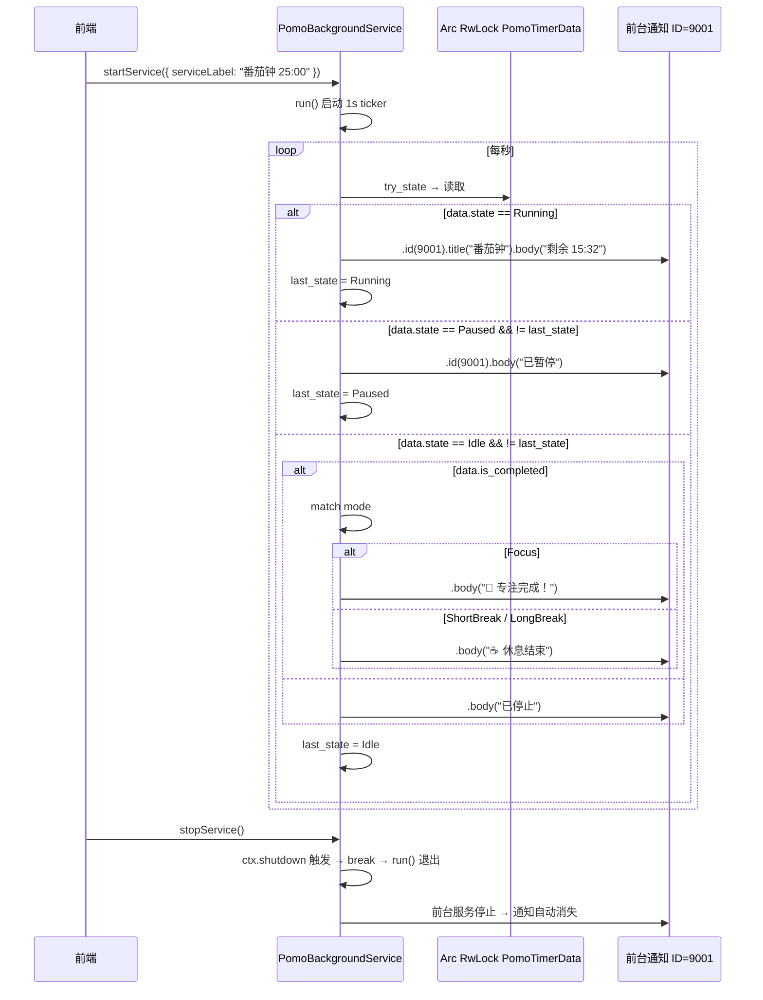

# Pomo 番茄钟系统文档

## 一、系统架构概览

---

## 二、完整生命周期

### 2.1 计时启动

### 2.2 暂停 & 恢复

### 2.3 主动停止

### 2.4 Tick 主循环 & 自然完成

### 2.5 完成处理 & 自动切换

---

## 三、Android 保活 & 通知系统

---

## 四、关键函数索引

| 函数 | 文件:行号 | 职责 |
|------|-----------|------|
| `PomoTimerManager::start_timer()` | `pomo_timer.rs:78` | 停止旧计时器，初始化 data，创建 cancel_token，spawn `run_timer_loop`。 |
| `PomoTimerManager::pause_timer()` | `pomo_timer.rs:125` | `data.state = Paused`，emit `pomo:state-changed`。 |
| `PomoTimerManager::resume_timer()` | `pomo_timer.rs:141` | `data.state = Running`，emit `pomo:state-changed`。 |
| `PomoTimerManager::stop_timer()` | `pomo_timer.rs:157` | 发 cancel 信号，重置 `state=Idle`, `time_left=total_time`。**不碰 `is_completed`**。 |
| `PomoTimerManager::get_data()` | `pomo_timer.rs:73` | 读取当前 `PomoTimerData` 快照。 |
| `PomoTimerManager::from_data()` | `pomo_timer.rs:65` | 使用外部 `Arc<RwLock<PomoTimerData>>` 构造（Android 共享）。 |
| `get_timer_manager()` | `pomo_timer.rs:294` | 从 managed state 获取或创建 `PomoTimerManager`（惰性初始化）。 |
| `run_timer_loop()` | `pomo_timer.rs:181` | `tokio::select!` 循环，等待 cancel 信号或每秒 tick。 |
| `tick()` | `pomo_timer.rs:207` | 每秒：检查状态 → 减 time_left → emit `pomo:tick` → 检测完成。 |
| `PomoBackgroundService::init()` | `pomo_background.rs:29` | 初始化回调，目前为空。 |
| `PomoBackgroundService::run()` | `pomo_background.rs:33` | 1s 循环，读取共享 data，用 `.id(9001)` 更新前台通知。 |
| `ensureBackgroundService()` | `useGlobalPomoTimer.ts:96` | 前端的 Android 保活启动封装，try-catch 兼容非 Android。 |
| `stopBackgroundService()` | `useGlobalPomoTimer.ts:107` | 前端的 Android 保活停止封装，try-catch 兼容非 Android。 |
| `handleTimerComplete()` | `useGlobalPomoTimer.ts:118` | 处理 `pomo:completed`：停止计时器、更新 DB、自动切换模式。 |
| `syncToBackend()` | `useGlobalPomoTimer.ts:249` | 同步前后端状态：启动/暂停/恢复/停止 + 保活生命周期管理。 |
| `startTimer()` (store) | `pomoStore.ts:139` | 创建 DB Session，设 `isRunning=true`。 |
| `stopTimer()` (store) | `pomoStore.ts:184` | 完成或中止 DB Session，更新 todayCount、任务进度。 |

---

## 五、事件表

| 事件名 | 方向 | 触发时机 | payload |
|--------|------|----------|---------|
| `pomo:tick` | Rust → 前端 | 每秒，正在运行时 | `{ timeLeft, totalTime, state, mode, sessionId }` |
| `pomo:state-changed` | Rust → 前端 | start/pause/resume/stop | `{ timeLeft, totalTime, state, mode, sessionId }` |
| `pomo:completed` | Rust → 前端 | time_left 归零 | `{ mode, sessionId }` |
| `app:resumed` | Rust → 前端 | 移动端从后台恢复 | 无 payload |

---

## 六、PomoTimerData 字段表

| 字段 | 类型 | 序列化 | 说明 | 写者 |
|------|------|--------|------|------|
| `state` | `TimerState` | `idle/running/paused` | 计时器状态 | `start_timer` = Running, `pause_timer` = Paused, `resume_timer` = Running, `tick`(完成) = Idle, `stop_timer` = Idle |
| `mode` | `PomoMode` | `focus/shortBreak/longBreak` | 当前模式 | `start_timer` |
| `time_left` | `i64` | seconds | 剩余秒数 | `start_timer` = duration, `tick` 每秒 -1, `tick`(完成) = 0, `stop_timer` = total_time |
| `total_time` | `i64` | seconds | 总时长 | `start_timer` = duration |
| `session_id` | `Option<i64>` | number/null | 数据库 Session ID | `start_timer` |
| `is_completed` | `bool` | true/false | 是否自然完成 | `tick`(完成) = true, `start_timer` = false; **stop_timer 不碰** |
